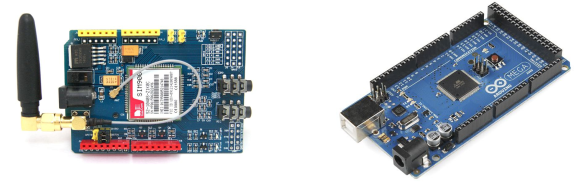
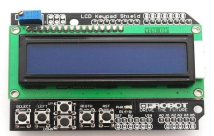
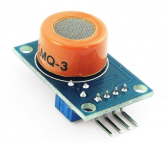
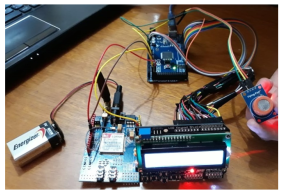

# ALCOHOLIMETRO
## By Arreguez, Rodrigo; Tello, Eric y Mora, Jonathan
### Universidad Blas Pascal - Ing. Informática - Lab 1 - 2019
------------------------------------------------------------------------------------------

## INTRODUCCION
En este proyecto buscamos la idea de mostrar la cantidad de alcohol que estuvo bebiendo una
persona y prevenir un consumo excesivo para luego no tener accidentes y/o problemas.
Para ello, la solución fue notificar el exceso de alcohol a una persona responsable mediante un
mensaje de texto.
Nos inspiramos en el método del “Conductor designado”. Con esto llegamos a la conclusión de
que cada persona debería tener alguien que sea responsable de él en casos de ebriedad.

## DESARROLLO

Lo primero a tener en cuenta fue cuáles serían los momentos de la verdad a los que nos
enfrentaríamos y determinamos los siguientes:
- Comprobar la funcionabilidad y el uso de cada componente por separado.
- Armado de componentes en conjunto, y código de los mismos.
- Comprobar si los componentes funcionaban en conjunto.

## Ensamblado

Para llevar a cabo este proyecto necesitábamos de 4 componentes importantes (Arduino Mega,
LCD Keypad Shield, SIM900, MQ-3 ).
Para el ensamblado, se utilizó el reciclado de una caja de juguetes hecha de acrílico de
dimensiones 19 cm x 12 cm y 4.30 cm de ancho.
Conectamos cada componente por separado a la placa Arduino con sus respectivos códigos,
comenzamos por el módulo SIM900 para comprobar que funcione correctamente y envíe
mensajes sin ningún problema.
En el modulo SIM900 utilizamos alimentación externa, mediante una batería de 9V.
Conectamos los pines 7 y 8, y el GND del SIM900 al Arduino.
Para comprobar que funciona presionamos el pulsador que hay en uno de los laterales durante
uno o dos segundos y veremos que se enciende otro LED, y que uno de los que se había
encendido antes empieza a parpadear una vez por segundo. Este parpadeo nos indica que está
buscando la red. Cuando la encuentre y se conecte cambiara la frecuencia de parpadeo y lo hará
cada 3 o 4 segundos

Luego decidimos conectar el LCD Keypad Shield para corroborar que
la pantalla funcione correctamente y muestre mensajes.

Por último procedimos a conectar
por separado el módulo MQ-3 para
que detecte gases en el aire.
Utilizamos la entrada analógica,
los pines de 5V y GND, los
conectamos al Arduino.
Verificamos la sensibilidad y
realizamos una conversión para

Luego procedimos al armado en
conjunto de los componentes. El
funcionamiento de los componentes es
el siguiente: El sensor detecta los gases
provenientes del alcohol y se muestra
por el LiquidCrystal lcd el grado de
alcohol que hay en el aire. Y luego si el
grado de alcohol sobrepasa el nivel de
0,5 se envía un mensaje desde Arduino
diciendo que la persona esta
alcoholizada.

Con respecto al código, decidimos que para enviar el mensaje haríamos una función que luego
llamaríamos en una condición
Todo esto se realiza en el setup. No lo realizamos en el loop porque daría muchos resultados por
segundo por ende enviaría la misma cantidad de mensajes y no es lo buscado.

## DIFICULTADES
La primer dificultado que nos surgió fue conseguir el sensor MQ3. Debido a su escasez. Esto nos
produjo un retraso de dos semanas.
Lo siguiente fue el LCD Keypad (display), debido a que utilizaba una librería que desconocíamos,
aparte de que pensábamos que utilizaba cierta cantidad de entradas pero necesitaba más. Y lo
conectamos mediante cables para poder utilizar las demás entradas del Arduino.
Tuvimos que informarnos, bastante, sobre la calibración del sensor.
La ultima dificultad surgió cuando el proyecto ya estaba terminado pero nos lo desconectaron por
completo para sacar el módulo Arduino. Como el modulo era una pieza troncal tuvimos que
conectar todo de vuelta, esto nos retrasó bastante.

## POSIBLES ACTUALIZACIONES
- Se podría incorporar un teclado matricial 4x4 para que el usuario pueda colocar el número
telefónico de su responsable / tutor.
- Lograr que el módulo SIM900 encuentre red automáticamente apenas se enciende y no
manualmente.
- Agregar un switch en las conexiones entre baterías y módulos.
CONCLUSIÓN
Nuestro proyecto fue creado con la intención de prevenir accidentes ocasionados por el alcohol,
en la construcción nos dimos cuenta de que podría ser comercializado o implementado en
métodos de seguridad, tanto policiales como caseros, es un proyecto innovador, es económico y
fácil de realizar si se tienen los conocimientos necesarios que nosotros adquirimos durante el
año..
Esto nos ayudó a informarnos sobre dicha problemática, empapándonos en el tema y aprendiendo
o descubriendo la medida de graduación de alcohol tanto en su estado puro como en el cuerpo
humano.
