# Aspiradora Robot

## Equipo:
* Godoy Lizzie
* Godoy Santiago
* Juarez Carlos
* Iriarte Jorge

## Inspiración
Para desarrollar  este proyecto nos inspiramos en las necesidades básicas del hogar, es por ello que diseñaremos un robot de tipo doméstico, incorporando funciones  que consideramos innovadoras, al robot convencional. Utilizando “Tinkercad”, un programa de modelado 3D en línea gratuito que se ejecuta en un navegador web. Alli desarrollaremos el diseño, circuito y código de programación del robot.

Nuestro objetivo es crear un robot didáctico, que cumpla con una serie de requisitos tales como: ser ampliable, programable y autónomo. El modelo de robot que tomamos como inspiración es el aspirador domestico.

El funcionamiento de un robot aspirador se basa principalmente en el empleo de sensores. Estos se encargan de detectar los obstáculos de cualquier habitación, es decir, muebles, electrodomésticos, paredes, etc., para no quedarse atascados al encontrarlos. Algunos modelos simplemente funcionan por camino recto.

## Antecedentes
Roomba es un aspirador robótico fabricado y vendido por iRobot. Se lanzó al mercado en 2002, y se calcula que en febrero de 2014 ya se habían vendido más de 10 millones de unidades en todo el mundo.

El robot aspirador Roomba incluye una serie de sensores (táctiles, ópticos y acústicos, dependiendo de cada serie y modelo) que le permite, entre otras cosas, detectar obstáculos, acumulaciones de residuos en el suelo y desniveles pronunciados tales como escaleras. Utiliza dos ruedas motrices independientes que le permiten ejecutar giros de 360 grados. Adicionalmente, se le puede programar para realizar otras funciones más “creativas” mediante un ordenador y haciendo uso de la denominada "Roomba Open Interface".

*[IMAGEN]*

## Materiales

### Componentes Electrónicos
* Arduino MEGA
* Sensores Ultrasónicos (x3)
* Relé
* Regulador de Voltaje step down
* Módulo blueetoth HC-06
* Controlador de motores L293D
* Protoboard
* Ventilador 12V 60mm
* Motor DC 3V-6V con ruedas (x2)
* Pilas recargables 18650 (x4)
* Porta pilas dobles (x2)
* Cables de conexion arduino
* Cables unipolares
* Botón Switch con retención o llave de 1 punto

### Varios
* Rueda "loca"
* Botella pequeña ~500mL
* Manguera
* Base de madera
* Tornillos M3 (opcional)
* Standoff M3 (opcional)
* Estaño para solar
* Barras de silicona

### Herramientas
* Destornilladores
* Pinza de punta
* Alicate
* Soldador de estaño
* Pistola de silicona

### Software
* Tinkercad
* App Inventor
* Arduino IDE

## Armado

### Simulación y diseño en Tinkercad

En primer lugar se plasmó la idea en tinkercad, para una aproximación al circuito, código y comportamiento que se pretendía. Se comenzó desde lo más básico, hasta lo más complejo. Primero se intentó solamente con una rueda y un sensor, probando cómo funciona cada parte y cómo se relacionan en conjunto. De esa manera se fue complejizando el circuito hasta la simulación del robot y la aplicación que se simuló con otro arduino comunicándose por puerto serie.

[Circuito electrónico en Tinkercad](https://www.tinkercad.com/things/ipW6RhDT6hI?sharecode=hFV6fbLXLOhXxvJJTwgbjpEZRCi8CXwuvF4kZiA6a2g)

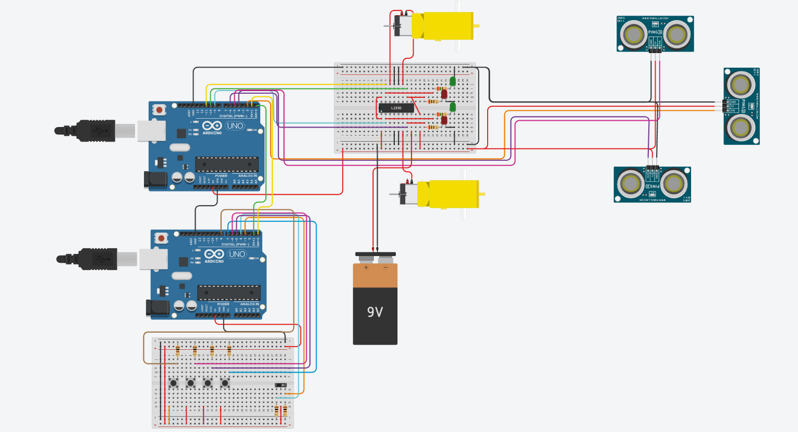

Luego se realizó un diseño en 3D para orientar el ensamblaje físico.

[Diseño 3D Tinkercad](https://www.tinkercad.com/things/1jsc8PHOvgw?sharecode=c8GkN69uCo7RVCra96F6EnAEyObauo9RfnZRwgXEPeQ)

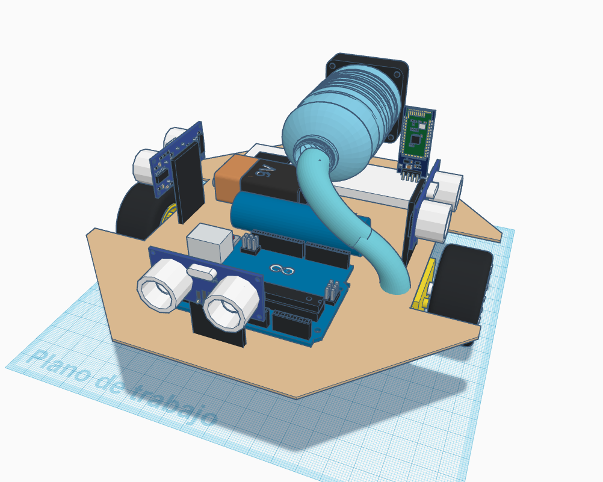

### Montaje

Una vez obtenido el comportamiento que se pretendía, o lo máximo que se puede a través de la simulación, simplemente se procedió a copiar el esquema de conexión, adaptado a los pines disponibles en Arduino MEGA. Lo que se agregó extra al circuito simulado fue el regulador de voltaje, relé, y se sustituyó la comunicación cableada de puerto serie por comunicación por el módulo bluetooth en el puerto Serial3 del Arduino Mega.

1) Se soldaron cables unipolares a los contactos de los motores DC, un cable por cada contacto. Estos cables son los que se conectarán al controlador de motores. Luego se fijaron los motores a la base de madera con silicona caliente. 
2) Se montó sobre la base de madera la protoboard con el pegamento trasero que posee, y el arduino utilizando tornillos M3 con sujetadores standoff M3. Si no se tiene de estos tornillos, con silicona caliente se puede fijar el arduino a la base.

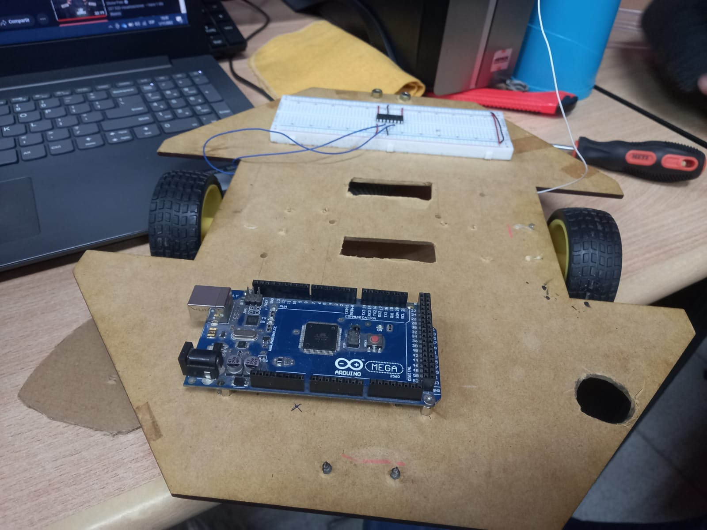

3) Se utilizaron restos plásticos y de madera, para hacer de soporte a los sensores ultrasónicos. Se pegaron con silicona caliente los sensores, cada uno a un soporte, y luego los soportes a la base de madera.
4) Siguiendo el esquema de conexión de la simulación en tinkercad, se conectaron todos los componentes, teniendo en cuenta que, en la simulación los sensores tenían 3 pines, y los que se tenían a disposición eran de 4 pines. Por lo tanto se eligieron pines contiguos para los pines de echo y trigger de los sensores.
5) Se armó con la botella, el ventilador ya la manguera un depósito para lo que se aspiraría. Se cortó el fondo de la botella para colocar el ventilador de modo que saque aire hacia atrás de la botella, es decir que genere una corriente desde el pico hacia el fondo. Con el fondo de la botella se hizo un marco para una tela que haría de filtro de polvo/partículas. Se colocó el filtro y por detrás el ventilador, fijando y sellando todo con silicona caliente.

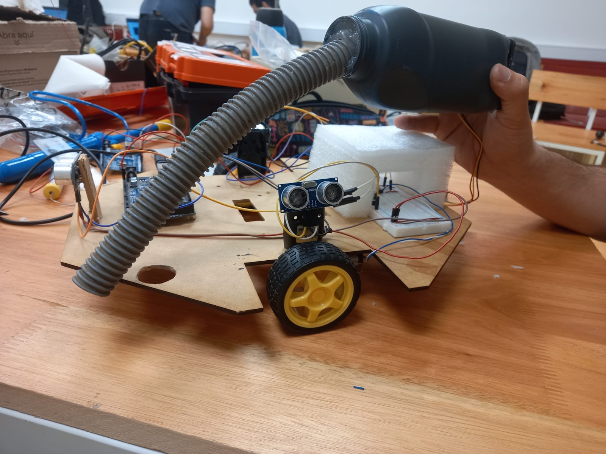

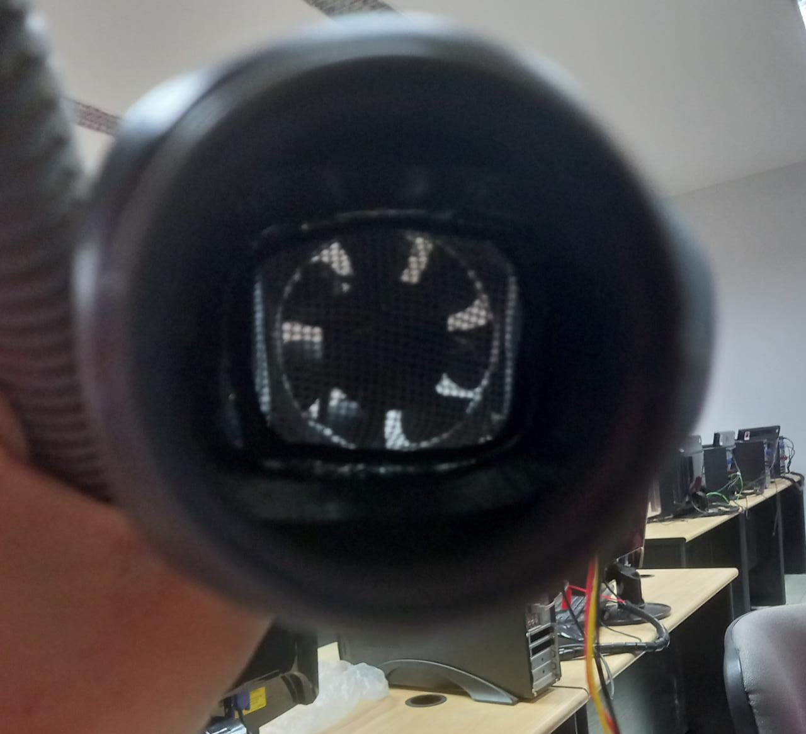

6) Se armó una conexión en serie entre los portapilas, para luego conectar el positivo al switch con retención y se recicló un conector macho de fuente AC-DC compatible con la alimentación externa de arduino, para conectar las pilas con el arduino. Las pilas se disponen en serie, teniendo un total de 15V aprox
7) Se colocó el relé en la protoboard, conectando 5v y ground, y se eligió un pin libre del arduino para conectarlo con el pin de señal en el relé. En los contactos del relé se conectó en el normal abierto la alimentación de 15v proveniente de las pilas y el cable positivo del ventilador. El cable de tierra del ventilador se conectó a tierra en la protoboard.

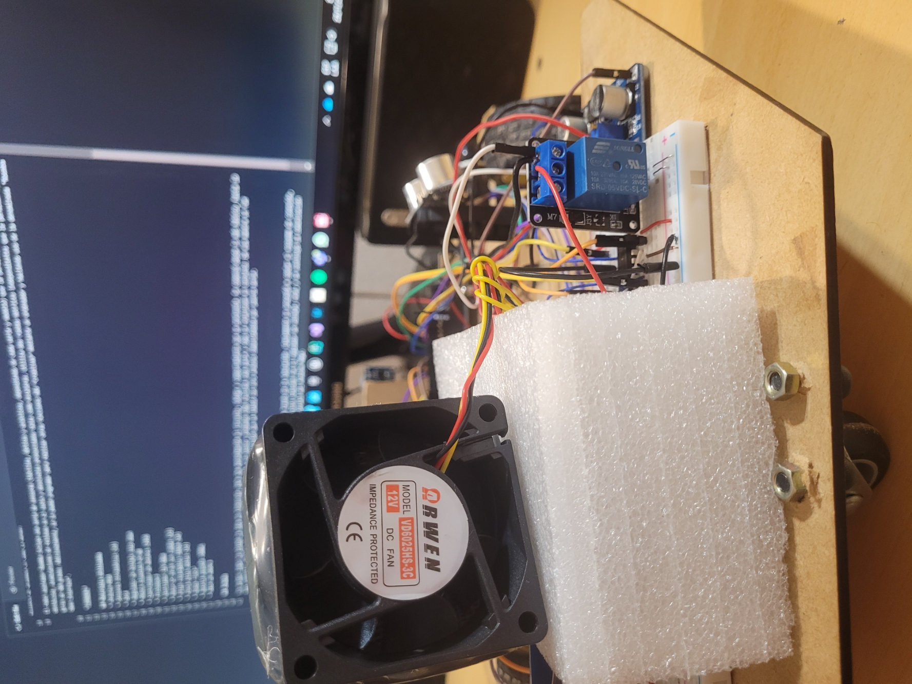

8) El regulador de voltaje se conectó tomando como entrada los 15V de las pilas, y la salida (se midió primero que saque 9V) al pin potencia 2 del controlador de motores. La salida del regulador de voltaje sería como la pila de 9V de la simulación

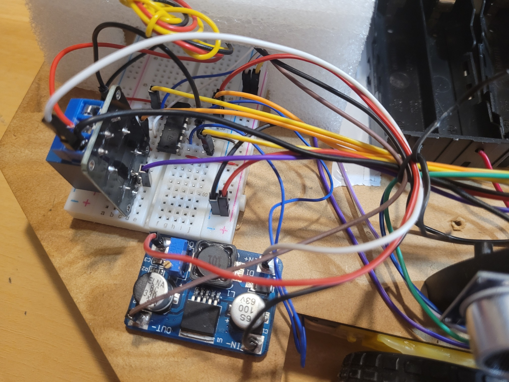

9) El Módulo bluetooth se conectó primero al arduino sólo, y se le cargó al arduino un código de configuración de bluetooth, para que, por medio de comandos AT se pueda cambiar el nombre del módulo bluetooth, el pin, y la velocidad de comunicación para que sea compatible con la aplicación de App Inventor. Luego, se conectó similar a cómo se conectaron los arduinos en la simulación, con la salvedad de que se utilizó el puerto Serie 3, del arduino MEGA.

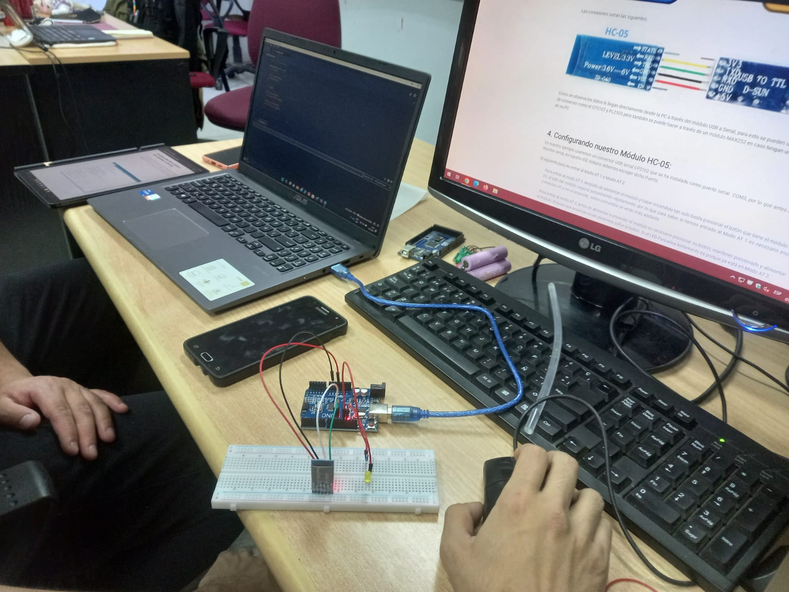

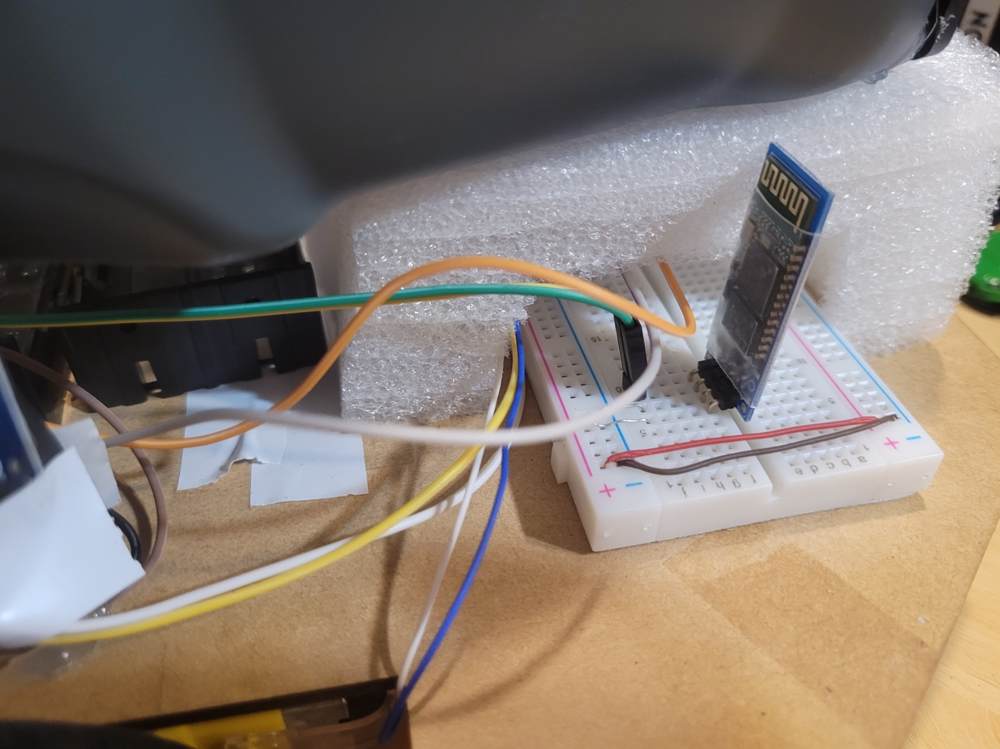

Todos los pasos antes mencionados, no se realizaron en secuencia como se muestra, sino que a través de prueba y error se fue dando forma final. De la misma manera de cómo se empezó a conectar todo en la simulación, así se hizo con el prototipo físico. Probando los comportamientos reales de cada componente, y cómo se relacionan con los demás.

### Apliación Móvil

Con App Inventor, se diseñó una aplicación sencilla que permita controlar el robot mediante bluetooth. La aplicación consta de 4 pantallas con funciones diferentes.

* Pantalla Principal: Tiene botones para seleccionar y conectar el bluetooth del arduino y desconectarse. Botón de modo automático, manual y botón de ayuda.

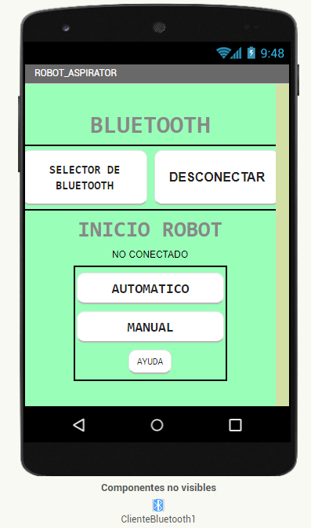

* Pantalla Modo Automático: Muestra la distancia que registra el sensor frontal, y tiene selectores para velocidad y distancia para esquivar objetos.

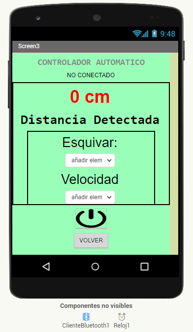

* Pantalla Modo Manual: Tiene los controles de adelante, atrás, izquierda y derecha, y botón para encender o apagar el ventilador de la aspiradora.

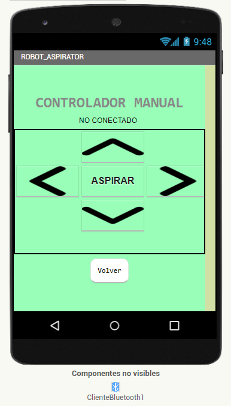

* Pantalla ayuda: Muestra un documento web con el manual de la aplicación.

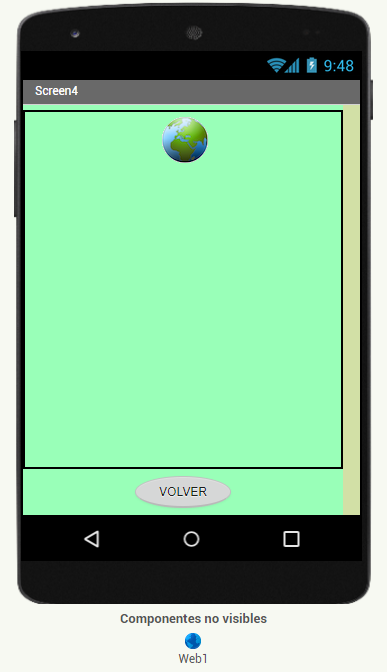

## Posibilidades de Mejora
Se podría agregar un acelerómetro y giroscopio para detectar golpes, o choques, que lancen una acción de esquivo o retroceso. Con el giroscopio se podría controlar el giro del robot para esquivar mejor los obstáculos. Además con un acelerómetro se podría detectar si el robot se estanca en algún lado y generar un alerta auditiva y por la aplicación. Se podría agregar un módulo WiFi para una conexión remota al dispositivo, configuración de rutinas de limpieza, control en remoto del robot para sacarlo de estancamientos, etc.

## Conclusión

Aunque las aspiradoras robot llevan años entre nosotros, aún no se han agotado todas sus posibilidades, u oportunidades de mejora. Emprender proyectos como estos, aunque en principio no es nada "nuevo", ayuda a comprender las bases de cómo funcionan estas cosas y qué se puede mejorar, cambiar, quitar o hasta incluso complementar con funciones de otros tipos de aparatos que quizás no se habían visto juntos en una misma unidad. 
