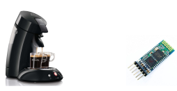
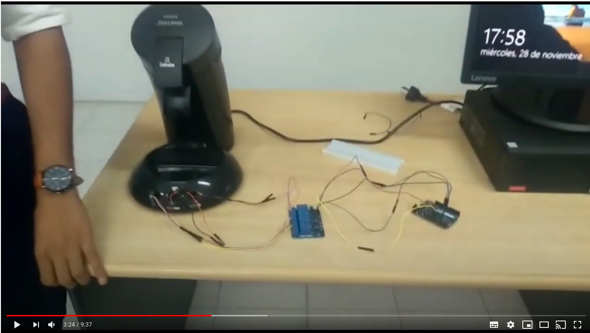
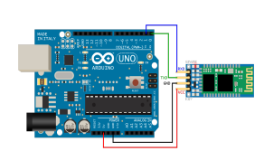
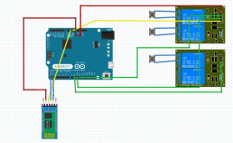
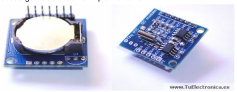

# Cafetera Bluetooth
## By 
### Universidad Blas Pascal - Ing. Informática - Lab 1 - 2019
------------------------------------------------------------------------------------------

## Arduino Leonardo

La placa Arduino Leonardo, puede ser alimentada a través de la
conexión micro USB o con una fuente de alimentación externa. La
fuente de alimentación se selecciona automáticamente.
La placa puede operar mediante una alimentación externa de 6 a 20
Voltios. En caso de alimentar la placa con menos de 7V, el pin de 5V
puede no llegar a este valor y la placa podría volverse inestable. Sin
embargo, si utilizamos más de 12V, el regulador de tensión puede
sobrecalentarse y llegar a dañar nuestra placa. Nosotros conectamos la
misma al micro USB.
El ATmega32u4 que incorpora el Arduino Leonardo, posee 32 KB (4 KB
utilizados para el bootloader). También ofrece 2,5 KB de SRAM y 1 KB
de EEPROM (los cuales pueden ser leídos y escritos con la librería
EEPROM).
La placa Arduino Leonardo ofrece importantes facilidades para obtener
comunicación con un ordenador, otro Arduino o incluso con otros
microcontroladores. El ATmega32u4 incorpora comunicación serie
UART TTL (5V) disponible en los pines digitales 0 (RX) y 1 (TX).
Este microcontrolador también nos permitirá establecer una
comunicación serial a través de USB (CDC) y aparecer como puerto
COM virtual con en nuestro sistema operativo. El integrado también
actúa a modo de dispositivo de máxima velocidad USB 2.0, utilizando
los drivers estándar de COM USB.
Para la elaboración de nuestro proyecto conectamos un módulo
bluetooth HC-05 y un modulo Rele de 4 canales a la placa.

## Modulo Bluetooth HC-05

Para comunicar el usuario con la cafetera utilizamos este módulo HC-05
conectado por puerto serie hardware. Por defecto viene configurado de
esta forma:
1. - Modo o role: Esclavo
2. - Nombre por defecto: HC-05
3. - Código de emparejamiento por defecto: 1234
4. - La velocidad por defecto (baud rate): 9600
Para editar esa configuración el módulo debe estar en modo AT2 , es
necesario tener presionado el botón al momento de alimentar el módulo,
es decir el módulo debe encender con el botón presionado, después de
haber encendido se puede soltar y permanecerá en este estado. Esto
nos permite enviar comandos AT pero hay que hacerlo a la velocidad de
38400 baudios.
### Comandos:
 - AT+ROLE=<Role> ​ (Esclavo o maestro)
 - AT+NAME=<Nombre> ​ (Nombre)
 - AT+PSWD=<Pin> ​ (Contraseña)
 - AT+UART=<Baud> ​ (Velocidad)
 
 La alimentación del módulo no la pudimos hacer por la placa ya que el
pin de 5v estaba ocupado por eso utilizamos una protoboard para la misma.

## Modulo rele 4 canales 5V 10 A

Para poder simular la acción de apretar un botón de nuestra cafetera
utilizamos un modulo rele de 4 canales. Lo que hicimos fue soldar con
estaño dos cables por cada botón y conectarlos a los canales del relé,
botón café grande al canal 4, botón encendido/apagado al canal 3 y
boton cafe chico al canal 2, . Luego conectamos desde el módulo relé a
la arduino su respectivas entradas (VCC a 5V, GND a GND, in4 a puerto
9 arduino, in3 a puerto 10 arduino y por último in4 a puerto 11 arduino).

## Aplicación móvil
Para crear la app utilizamos el entorno de desarrollo de software MIT
APP INVENTOR, ya que es gratuito, y contiene un conjunto de
herramientas básicas que nos permite ir enlazando una serie de bloques
para crear la aplicación, además es muy simple y es de fácil
comprensión.Link de descarga del archivo .aia
https://mega.nz/#!uhl0yKTZ!6B4n1vvijVudSmTnvZyqCrgVDceRCUd3K0
yXxYBUMys

## Pendiente
Una de las cosas que al iniciar este proyecto quisimos implementar fue
el uso de un módulo Tiny RTC (reloj) para poder elegir un horario en el
que la cafetera hiciera el café. Por motivos de tiempo y complicaciones
en el código decidimos no implementarlo.

