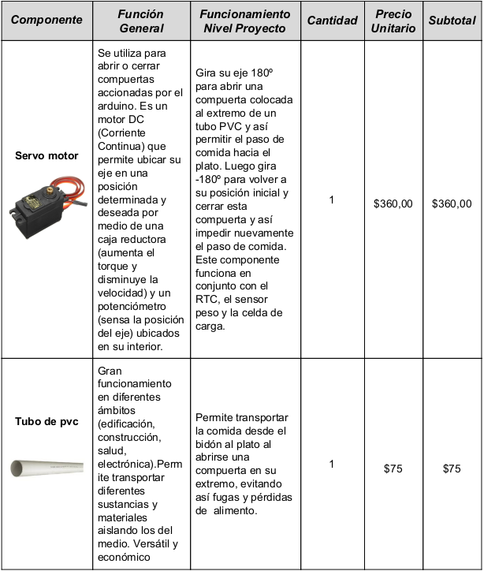
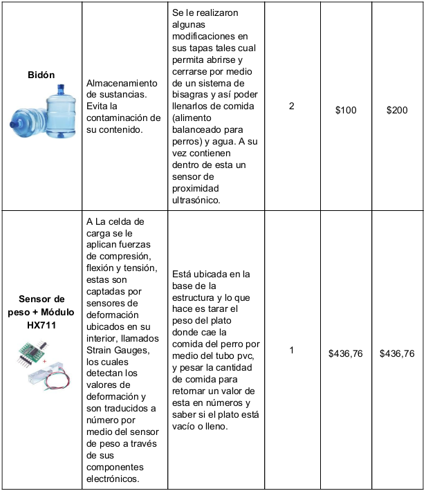
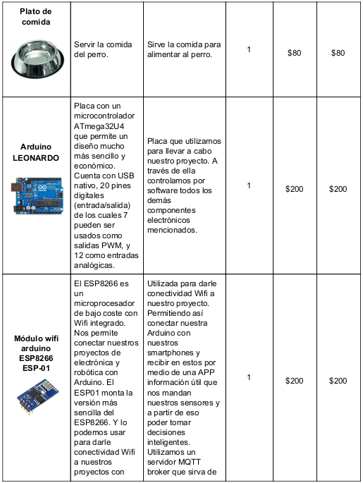
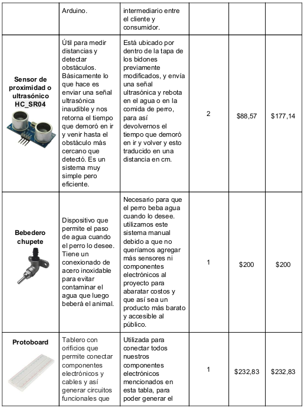
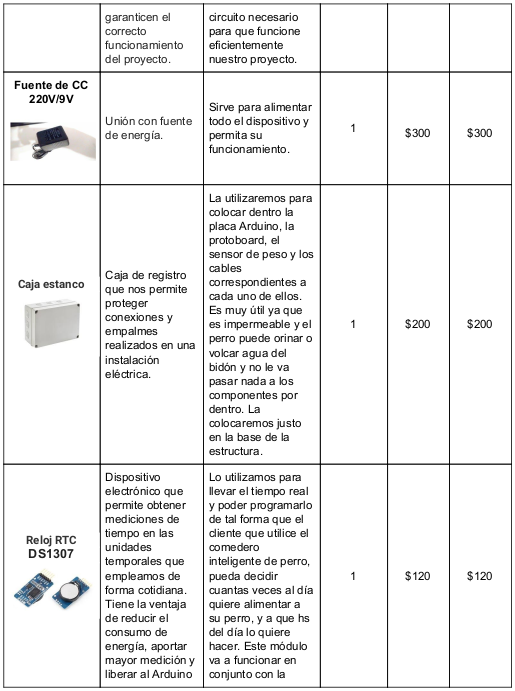
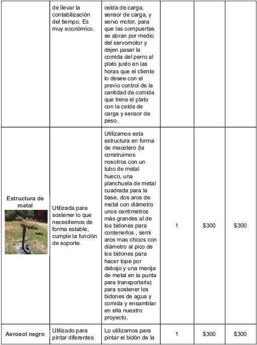
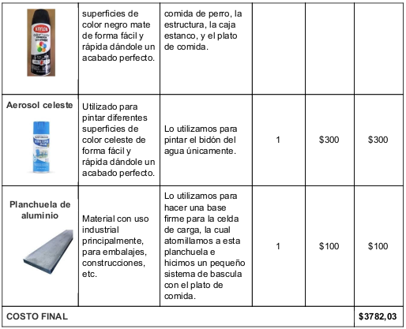
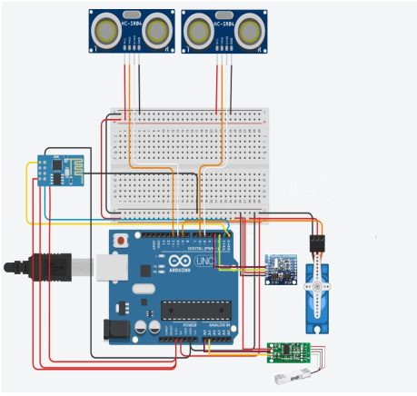

# Comedero para perros
## By BETTIC, Federico; BOZZANO, Felipe; CERMAK, Matías; FERNANDEZ, Jeremias; FERREYRA, Tomás; OLMOS, Francisco; ZABALA, Mariano.
### Universidad Blas Pascal - Ing. Informática - Lab 1 - 2019
------------------------------------------------------------------------------------------
## Introducción
El objetivo de este proyecto es incluir internet de las cosas en una tarea
cotidiana, para lograr autonomía y comunicación constante entre el dispositivo y el
consumidor a través de Wifi y el protocolo MQTT.
La idea es hacer un comedero inteligente para perros que permita darle de
comer y beber a la mascota sin que el dueño esté presente. Esto podría permitirle
ausentarse un tiempo sin preocuparse por dicha tarea. Además, la autonomía del
mismo, permite una alimentación mejor que la que nosotros podríamos ofrecer a
nuestras mascotas.
En el desarrollo de este tutorial, vamos a explicar cuál fue la idea original, la
evolución de ésta, como hicimos para conseguir los materiales, los testeos que
tuvimos que hacer para poder conseguir un diseño original eficiente y útil y que cual
fue el resultado.

## Idea Original
Realizar un comedero automatizado y autónomo, con horario programable diseñado
para alimentar al animal cuando sea necesario. Gracias a esto se puede dejar al animal solo
con la seguridad de que será alimentado.
En base a esta idea, realizamos investigaciones pertinentes para conocer el
mercado y hemos encontrado diseños ya comercializados de este tipo de producto. A partir
de allí, nos propusimos la meta de crear un producto que no sólo automatice la alimentación
del animal, sino que además mantenga al tanto al dueño del producto, de los hábitos
alimenticios del animal, cantidad de alimento en el depósito y, a su vez, se alcance cierto
grado de eficiencia en la alimentación, evitando derroche de contenido, entre otras cosas.

## Diseño
En el diseño original, había una estructura con una base en forma de trípode que
fuera lo suficientemente estable como para soportar el peso de dos bidones llenos de
comida y agua. Esto no fue viable ya que pensamos que al tener un trípode en la base
podría ser bastante molesto al perro a la hora de comer y corría el riesgo de caerse y
romperse si el perro lo golpeara o rozara con su torpeza. Esto era un problema ya que
originalmente los bidones que sostenía la estructura contenían un doble fondo donde
colocaríamos la placa arduino y la protoboard, y si se llegara a caer , se podrían mojar o
dañar. En base a esto decidimos ponerle una base firme en forma de planchuela cuadrada
lo suficientemente grande como para que el peso de los bidones no la vuelquen, y a su vez
no es molesto para el perro ya que no es alta, puede pisarla y no lo estorba a la hora de
comer.
En cuanto al doble fondo de los bidones que pensábamos diseñar para colocar
dentro la arduino y la protoboard, decidimos no hacerlo y en vez de eso conseguimos una
caja estanco con bastante espacio donde podríamos colocar la placa arduino, la
protoboard,cables y módulos necesarios, sin correr el riesgo de que nada se moje, ya que
es impermeable, y nada sufra daño de golpes por el perro. Esta caja decidimos colocarla en
la base. Desde un principio tuvimos la idea de un diseño que incluía una estructura tipo
esqueleto que sostuviera los dos bidones, tanto el del agua como el de la comida, por medio
de unos aros de metal que los rodearan y una boquilla con el diámetro del pico del bidón
que lo sostuviera por debajo e hiciera de tope. De esta manera podríamos disponer de los
dos bidones parados con el pico hacia abajo para dispensar la comida y la bebida.

## Lista de Elementos

## Adquisición de Elementos

La mayoría de los componentes electrónicos necesarios para la elaboración, fueron
adquiridos a través del website de compra y venta ​ Mercadolibre​ , realizando la compra a un
mismo proveedor generando ahorro en costos de envío.
Logramos un ahorro considerable en elementos no electrónicos destinados a la base
del producto, y elementos decorativos. Ambos fueron adquiridos a través de contactos,
además de ser algunos reciclados, ahorrando en su adquisición.

## Testeo de elementos
Una vez adquiridos los diferentes componentes esenciales del proyecto,
comenzamos una serie de tareas correspondientes al testeo de los mismos, para
comprobar su funcionamiento, corroborar la utilidad, y aprender el correcto manejo de los
mismos. Detallamos a continuación el proceso de testeo de los componentes mencionados:

### Módulo WiFi ​ :
El primer componente con el cual entramos en contacto es el módulo
de conexión WiFi: el módulo ESP8266 ESP01. Este componente permite la
conectividad a redes WiFi de dispositivos como las placas Arduino,
Raspberry Pi, o incluso puede funcionar de manera autónoma. Dada la
naturaleza de nuestro proyecto, es la función de entregar conectividad a la
placa Arduino la que nos interesa.
Comenzamos entonces la tarea de familiarizarnos con el módulo
ESP01 y, previa investigación, realizamos la conectividad física del módulo a
la placa Arduino. En este punto nos hemos encontrado con varios obstáculos
dado que hay varias formas diferentes de realizar las conexiones, y muchas
de ellas es a través de complementos con los que no contamos. Luego de
varios intentos fallidos, cambios de diseño de conexión, y gracias a la ayuda
de expertos, logramos concretar una forma de conexión física a través de la
cual podemos enviar comandos al módulo ESP01 y obtener respuesta
correcta. Arduino quedó, finalmente, conectado a la red.

### ​ Celda Carga + Módulo ​ HX711:

Para el testeo de este componente necesitamos calibrar la celda de
carga con unas pesas de 50g c/u, pusimos 300 g (5 pesas) en total en la
punta de la celda de carga. Este calibrado lo hacemos ya que sin él las
mediciones de peso que realiza la celda de carga y nos devuelve el módulo
HX711 son ilógicas y no se asocian a nuestras unidades de medición
estándares. En cambio al realizar el calibrado, nosotros le decimos cómo
debe medir y que haga las conversiones necesarias par que cuando le
ingresemos un kilo de comida de perro nos devuelva aproximadamente un
kilo como valor pesado.
Por ende el Una vez calibrada, necesitamos tarar el peso del plato
en donde se colocará la comida a pesar. Esto lo realizamos por software. Es
decir que el peso del plato es guardado internamente, para que cuando
pesamos la comida del animal, este se resta al total.
Esta celda de carga la fijamos mediante unos tornillos a una varilla
de aluminio, la cual fijamos a su vez a la base de la estructura. En la punta
contraria a la fijada es donde le colocaremos el peso del plato y la comida
sobre el mismo para pesarla.
La celda de carga trabaja por tensión, compresión y flexión. Estas
fuerzas son captadas por sensores que están ubicados en el interior de la
celda y son llamados Strain Gauges. Estos detectan los valores de
deformación que sufre la celda en el medio, donde es hueca, y son traducidos
a números a través del módulo HX711. Otro dato a tener en cuenta es que no
debe aplicarse una fuerza superior a la de 1 kg de fuerza sobre el plato que
está apoyado sobre la celda de carga, ya que esta soporta 1 kg, si bien tiene
una tolerancia de unos +100g, es aconsejable no excederse de ese peso.
Es importante tener en cuenta que este módulo HX711 cuenta con
alimentación de +5V.

### ​ Módulo RTC (tiny RTC):
La función de este componente es bastante simple, como ya hemos
mencionado, lleva la cuenta del tiempo que pasa en la medida que está
energizado. Para ello cuenta con dos tipos de alimentaciones:
1. +5V que se obtienen de la placa arduino. Es decir que
mientras esté conectado a una arduino energizada, el reloj va
a estar tomando el tiempo.
2. +3V que se obtienen de una batería de litio (CR1255), que es
la misma que se utiliza en las computadoras.
Mientras el módulo esté energizado de alguna de las dos maneras, no
va a perder la cuenta del tiempo, incluso puede tener ambas fuentes
conectadas al mismo tiempo.
Para probar el funcionamiento utilizamos los códigos de ejemplo de la
librería ​ DS1307RTC.h​ . Primero corrimos SetTime para darle los parámetros
del tiempo actual, y luego ReadTest para comprobar que el módulo
estuviese funcionando correctamente. Para ésto hay que tener en cuenta
dos detalles:
1. Si en algún ejemplo tiene incluída la librería ​ Time.h​ , cambiarla
por la librería ​ TimeLib.h​ que es la correcta.
2. Dependiendo de la versión de arduino que utilicemos, los
pines a los que van conectadas las salidas ​ SCL​ y ​ SDA​ del
reloj van a cambiar. Ésto se puede revisar en la librería ​ Wire​ .
Si ambos códigos corren en la IDE Arduino, entonces el módulo RTC
trabaja correctamente. Para verificar el funcionamiento de alguno de los dos
códigos, simplemente hay que abrir el monitor serial de la IDE una vez que
se carga uno al módulo.

### Servo Motor:
En este caso el Servo Motor va a ser utilizado en nuestro proyecto
como parte del mecanismo que dispensa la comida, este estaría ligado a
una especie de compuerta giratoria que al accionar el servo esta se moverá
dejando pasar la comida hasta que el servo sea accionado nuevamente,
para el testeo de este componente se utilizó la librería “Servo.h” y mediante comandos básicos se le setea una determinada cantidad de grado en
números enteros, haciendo que el servo se mueva entre un límite de entre
0o y 180o. Es importante saber que el servo funciona con 5v directos de
Arduino, y el pin de datos puede ir en el pin 9 o 10 de Arduino, en nuestro
caso lo colocamos en el pin 9.
Es muy importante a la hora de elegir el servo, que sea uno de 180°
convencional y no uno de 360° de giro continuo, ya que este último solo se
puede manejar la velocidad de giro en ambas direcciones pero no la
posición en grados. En cambio con el convencional, uno puede moverlo en
la dirección que quiera y dejarlo en una posición determinada con el uso de
los grados, y esto es justamente lo que necesitamos para abrir y cerrar
rápido la compuerta y dejar pasar la comida.

### Sensor Ultrasónico:
El sensor de ultrasonido se utiliza para medir los niveles de comida y
agua en los diferentes contenedores, el sensor envía ondas de sonido de
una frecuencia que ronda los 40 kHz y mediante un receptor capta este
mismo y calcula el retardo entre el envió y la recepción que, mediante
código (añadiendo la librería “NewPing.h”) se traduce a distancia en cm,
llevando esto a nuestro proyecto, lo que se mide es la distancia entre el
sensor y el alimento o el agua, a mayor distancia menos comida/agua hay
en el contenedor.

### MQTT:
Una vez que esté armado el circuito y su correspondiente código,
debemos poder establecer una comunicación con el dueño del dispositivo,
basándonos en la conectividad a la red provista por el módulo ESP01.
Para esta tarea utilizaremos el protocolo MQTT. Este es un protocolo
de comunicación para realizar conexiones simples y ágiles de baja cantidad
de bits. El proceso básicamente consiste en un servidor donde se centralizan
las comunicaciones a realizar entre los dispositivos. Luego se subdividen las
comunicaciones por grupos de operaciones o información a transmitir. Por
último, tanto Arduino como el correspondiente dispositivo móvil se
“suscribirán” a una o varias subdivisiones de las mencionadas, para allí
enviar o recibir información.
Se han realizado varias pruebas para elegir la mejor metodología
para emprender este proceso comunicativo, optando entre diferentes
metodologías y sus respectivos códigos de conección, suscripción, envío y
recepción de mensajes. El conjunto de líneas de código emprenderá también
la tarea de conectar el sistema a la red, para manejar las conexiones como
un “todo” donde sus partes están interconectadas.

## Diseño de estructura
### Planteos, procesos y construcciòn

Preparamos dispensers/bidones con sistemas de tapas con bisagras que permitan
abrirlas y cerrarlas fácilmente para su llenado o por cualquier inconveniente que surja.
Para realizar estas tapas cortamos las partes superiores de los mismos bidones en
el caso del dispensador de comida (Negro) y le colocamos la parte superior de otro bidón
como tapa para el dispensador del agua (celeste). Estos bidones tienen colocados por
dentro en sus respectivas tapas un sensor ultrasónico, cuyos cables van alrededor del tubo
central de la estructura hasta la caja estanco. Estos sensores lo que hacen es enviar una
señal de ultrasonido inaudible, la cual rebota en la comida o en el agua, depende el caso, y
vuelve al sensor para tomar el tiempo en que fue y volvió la señal y esta traducirla en cm.
De esta forma nosotros vamos a poder alertar al cliente en qué estado están los bidones de
comida y agua por medio de MQTT DASH.
Para la estructura que sostiene estos dos bidones utilizamos materiales resistentes,
livianos y reciclados para ahorrar (es de metal). En sí necesitamos un tubo hueco, una
planchuela cuadrada, dos aros de metal del diámetro del cuerpo de los bidones, y dos aritos
con el diámetro del pico de los bidones y por último le hicimos una manija en la punta del
caño para poder agarrarla y transportarla con facilidad.
En la base de la estructura fijamos una caja estanca en la cual colocamos la placa
Arduino, protoboard, el módulo HX711 y los cables correspondientes a cada una de ellas y
los cables que van a los sensores ultrasónicos que están ubicados en las tapas de los
bidones, para la los cuales tuvimos que hacer extensiones de cable.
Para la celda de carga,usamos sistema de bisagra en la punta del plato que permita
el vaciado del mismo por cualquier inconveniente y fijamos la celda al otro extremo con 2
tornillos a una varilla de aluminio dejándola bien rígida y lista para tarar y pesar, esta varilla
a su vez va fija a la base.
En cuanto a tamaño no ocupa mucho espacio y no pesa mucho, buscamos que sea
cómodo para el usuario. Lo planeado sería ,que sirva comida 5 veces al día (horas y
minutos predeterminados por software por medio de 2 vectores), y permita un llenado de
plato cuando el usuario lo desee con el solo uso del MQTT DASH presionando el botón
servir.. Cuando sea la hora asignada o el usuario presione servir, verifica el peso del plato
por medio de la celda de carga y el módulo HX711 para saber si el plato se encuentra lleno,
medio lleno o vacío. En los dos últimos casos llena el plato abriendo la compuerta del tubo
pvc por medio del servo.
En el caso del agua nunca se sirve, el perro toma agua cuando quiere con el
bebedero con chupete.

## Código
Para la parte de software, nos enfocamos en que todo funcionara correctamente por

separado en principio. Cuando comprendimos el funcionamiento de cada pieza y como era
la lógica detrás de su programación, decidimos hacer un diagrama de flujo para poder
visualizar el funcionamiento integral del dispositivo. Mientras hacíamos esto, también
llevábamos una lista de todas las librerías que serían utilizadas. Luego de esto, utilizamos
los códigos que creamos uniéndolos y comprobando que nada interfiera entre sí, para
después poder integrarlo todo.

## Esquema Eléctrico

## Conclusión
Este proyecto nos dejó varios aprendizajes. Es muy diferente trabajar en software
como por ejemplo Tinkercad y realizar todo el conexionado de Arduino con sensores de
peso, módulo Wifi, sensores ultrasónicos y servo, lo cual puede llevarnos unos minutos, que
trabajar con hardware y tener que conectar los cables físicamente, darse cuenta las
distancias desde un sensor a la placa Arduino para calcular el largo del cablo, hacer
extensiones si es necesario. Es decir que hay una gran brecha entre lo teórico y lo práctico.
Lo mismo nos pasó con el MQTT, entendíamos cómo funcionaba el protocolo de
comunicación, sabíamos que era como un intermediario entre los sensores y los usuarios
que quisieran consultar los mismo. Pero al momento de tener que establecer esta
comunicación tuvimos muchas dificultades porque nunca habíamos tenido contacto con la
misma y nos llevó tiempo para familiarizarnos.
