# Detector de Gas y Monóxido de Carbono
## By Blanco, LEANDRO  /  Zeitune, PABLO MARTIN   

## Descripción

Se realizó un detector autónomo de gas y monóxido de carbono con dos entradas analógicas y una salida digital, el cual se conecta a internet mediante una conexión WiFi, permitiendo ser monitoreado y accionado mediante una aplicación HTML o dispositivo móvil donde permite recibir notificaciones a través de la suscripción del Tópico “gases”, la detección de los gases y accionar la salida de forma automática (Buzzer). El dispositivo cuenta con dos sensores electroquímicos de gases, estos son leídos por un microcontrolador y enviados a través de una conexión WiFi que se encarga de conectarse con un servidor en la nube mediante el protocolo MQTT. Se obtuvo un dispositivo robusto capaz de detectar pérdidas de GAS y detectar CO de forma rápida y sin falsas.
Como parte del trabajo conjunto del aula se obtuvo un enlace rápido y eficiente a través de internet al utilizar un protocolo utilizado en dispositivos IOT. 

Palabras Clave: Aplicación móvil, Detector de gas, Detector de monóxido de carbono, IOT, MQTT, WiFi.

### NodeMCU ESP-32S

El NodeMCU ESP-32S es una de las placas de desarrollo creadas por NodeMcu para evaluar el módulo ESP-WROOM-32. Se basa en el microcontrolador ESP32 que cuenta con Wifi, Bluetooth, Ethernet y soporte de baja potencia, todo en un solo chip.

### Estableciendo la conexión entre el servidor MQTT y ESP32 

IoT es un sistema que conecta los dispositivos a los que se puede acceder a través de Internet. Hay varias plataformas y protocolos en la nube, MQTT es uno de los protocolos más utilizados para proyectos de IoT.
ESP32 es el sucesor del módulo ESP8266 WiFi , con muchas características avanzadas como es una CPU de doble núcleo de 32 bits con WiFi incorporado y Bluetooth de modo dual con una cantidad suficiente de 30 pines de E/S.
Si bien MQTT significa Transporte de telemetría de Message Queue Server, es un sistema donde podemos publicar y suscribir mensajes como cliente. Al usar MQTT puede enviar comandos para controlar salidas, leer y publicar datos de sensores y mucho más. Hay dos términos principales en MQTT, Cliente y Broker.
 
#### ¿Qué es MQTT Client & Broker? 
Cliente MQTT:  un cliente MQTT ejecuta una biblioteca MQTT y se conecta a un agente MQTT a través de una red.  Tanto el editor como el suscriptor son clientes MQTT. El editor y el suscriptor se refieren a si el cliente está publicando mensajes o suscribiéndose a mensajes.
Intermediario MQTT:  el intermediario recibe todos los mensajes, filtra los mensajes, determina quién está suscrito a cada mensaje y envía el mensaje a estos clientes suscritos.

#### Explicación del Código ESP32-MQTT Broker:
El código completo para  conectar ESP32 con el agente MQTT se proporciona al final . Aquí, estamos usando  Arduino IDE para programar ESP32 . Primero,  instalamos la biblioteca WiFi.h y la biblioteca PubSubClient.h .

La biblioteca PubSubClient nos permite publicar / suscribir mensajes en tópicos.

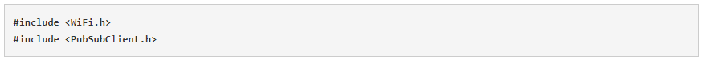

Ahora declaramos algunas variables globales para nuestras conexiones WiFi y MQTT.
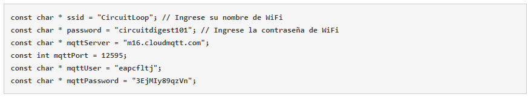

La función setup_wifi  verificará el WiFi, ya sea que esté conectado a la red o no, también proporcionará la dirección IP e imprimirá en el monitor serie.
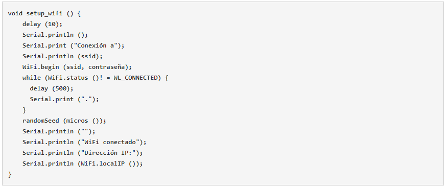

A continuación, mientras funciona en bucle, se conectará al servidor MQTT y lo imprimirá en el monitor en serie. Este proceso se ejecutará en un bucle hasta que se conecte.

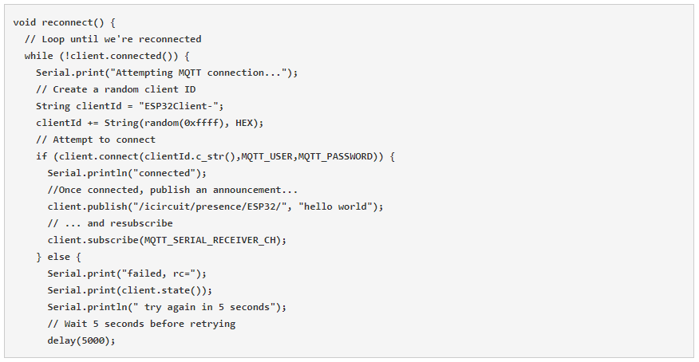

Ahora especificaremos una función de devolución de llamada y en esta función, primero imprimiremos el nombre del tema y luego recibiremos el mensaje.

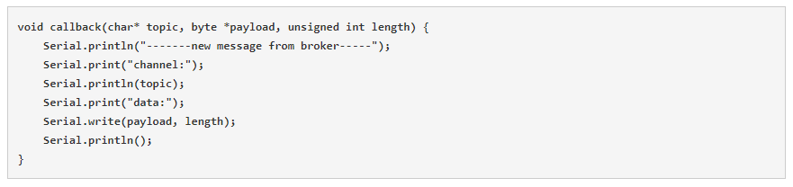

Conectando con la red WiFi y servidor MQTT:

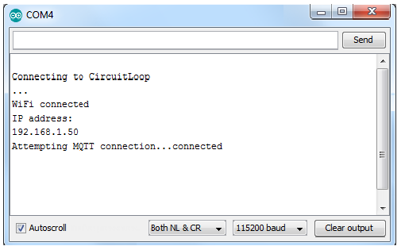

### Sensores de gas MQ

Los sensores de gas de la serie MQ son sensores analógicos por lo que son fáciles de implementar con cualquier microcontrolador.

Estos sensores son electroquímicos y varían su resistencia cuando se exponen a determinados gases, internamente posee un calentador encargado de aumentar la temperatura interna y con esto el sensor pueda reaccionar con los gases provocando un cambio en el valor de la resistencia. El calentador dependiendo del modelo puede necesitar un voltaje entre 5 y 2 voltios, el sensor se comporta como una resistencia y necesita una resistencia de carga (RL) para cerrar el circuito y con este hacer un divisor de tensión y poder leerlo desde un microcontrolador:

Debido al calentador es necesario esperar un tiempo de calentamiento para que la salida sea estable y tenga las características que el fabricante muestra en sus datasheet, dicho tiempo dependiendo del modelo puede ser entre 12 y 48 horas.
En el mercado, generalmente los sensores MQ se encuentran en módulos, lo que nos simplifica la parte de conexiones y nos facilitan su uso, solo basta con alimentar el módulo y empezar a leer el sensor, estos módulos también tienen una salida digital la cual internamente trabaja con un comparador y con la ayuda de un potenciómetro podemos calibrar el umbral y así poder interpretar la salida digital como presencia o ausencia del gas.
La diferencia entre los distintos tipos de sensores MQ es la sensibilidad a cierta gama de gases, más sensibles a algunos gases que a otros, pero siempre detectan a más de un gas, por lo que es necesario revisar los datasheet para escoger el sensor adecuado para nuestra aplicación.

#### Sensor de gas combustible MQ-5
Estos sensores son adecuados para detectar GLP, propano, metano, hidrógeno. Siendo más sensible al GLP y propano.

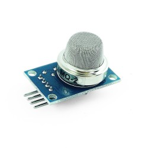

#### Sensor de Monóxido de Carbono MQ7
Este sensor es de alta sensibilidad al monóxido de carbono (CO), pero también es sensible al H2.
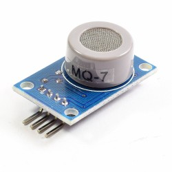

### Lectura Digital de los módulos MQ
Tan pronto se alimente el módulo este empezará a calentar, hay que esperar unos minutos para que el modulo caliente y tener un censado adecuado, y entre 12hs y 48hs para que el valor sea estable y confiable.
En este caso la lectura desde Arduino/ESP32 es como leer cualquier entrada digital, y la sensibilidad del sensor se configura a través de la resistencia variable que trae el modulo, girando a la derecha se hace más sensible y necesitamos menos presencia de alcohol para activar la salida, de igual forma si giramos a la izquierda aumentamos el umbral necesitando mayor presencia del gas (alcohol) para que se active la salida.
La salida del sensor es negado, por lo que cuando nos referimos a activar el sensor es cuando la salida es 0, en este estado el led del módulo también debe encenderse ya que internamente está con una resistencia a 5V. Cuando no hay presencia de alcohol el Led se apaga y la salida es un 1 lógico (5V).

### Lectura Analógica de los módulos MQ
Para este caso debemos de conectar la salida analógica del módulo a una entrada analógica del Arduino/ESP32. Será la implementación utilizada en nuestro proyecto.
 La diferencia de utilizar la salida digital, es que usando la salida analógica podemos trabajar con diferentes niveles de presencia de gas y ajustarlo de acuerdo a la necesidad de nuestra aplicación.
 Al tratarse de una salida analógica, el código es el mismo para cualquier tipo de sensor MQ con el que estemos trabajando.
Debido a que el modulo tiene una cámara de calentamiento a donde tiene que ingresar o salir el gas, el tiempo de respuesta es lento, el sensor seguirá detectando los residuos de gas que se quedan dentro de la cámara de calentamiento hasta que estos desaparezcan.
Tener en cuenta que todos los módulos son sensibles a más de un gas, claro que en diferente proporción; pero si se trabaja en ambientes en donde hay diferentes tipos de gases no podríamos diferenciar entre ellos y podríamos tener una referencia equivocada si solo necesitamos leer un gas. La entrada Analógica mostrara los valores del ADC SAR de 12 bits del ESP32 (de 0 a 4095).

### Ajustando los sensores MQ
Si en nuestra aplicación que estamos implementando necesitamos los valores en unidades correspondientes a la medición del gas, necesitamos ajustar el valor leído, el problema de esto es que la relación entre la lectura analógica y el valor real no es lineal. Por lo que necesitamos estimar la curva que nos da el datasheet

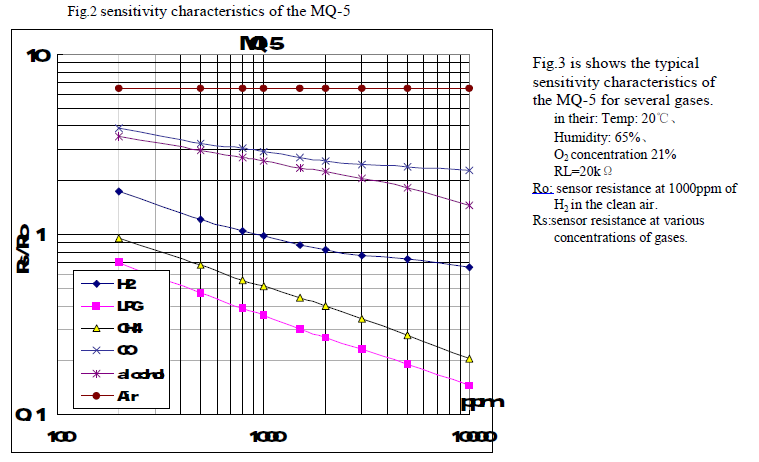

Debido a que nos da la curva y no la ecuación es necesario estimar y por regresión lineal y hallar la ecuación, en nuestro caso usaremos Excel, para eso ingresamos datos de la curva de GLP, la mayor cantidad de puntos que podamos, y graficamos en Excel. Agregamos línea de tendencia y escogemos ecuación potencial

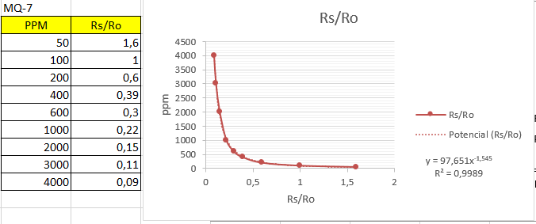
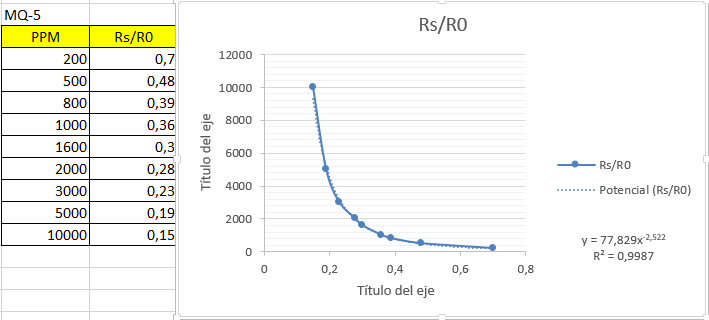

La ecuación que obtenemos es:

- CO=97.651*(Rs/Ro)^(-1.545)
- GAS=77.829*(Rs/Ro)^(-2.522)

El valor de Ro se calcula en laboratorio, Ro es el valor de Rs cuando se usa una muestra de aire libre o con 1000ppm de H2. Y hay que hacer esto para cada sensor puesto que Ro es diferente en cada sensor.
Para calcular Ro utilizamos la siguiente lógica y el consecuente programa de medición:
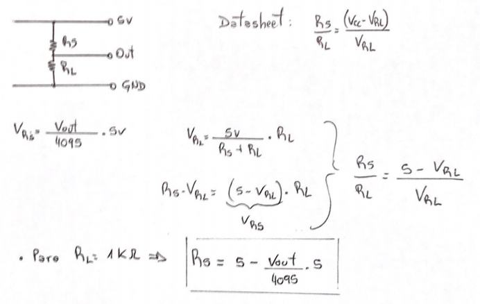

        void setup() {
         Serial.begin(9600);
        }
        void loop() {
         float sensor_volt;
         float RS_air; // Get the value of RS via in a clear air
         float R0; // Get the value of R0 via in H2
         float sensorValue;
        /--- Get a average data by testing 100 times ---/
         for(int x = 0 ; x < 100 ; x++)
         {
         sensorValue = sensorValue + analogRead(36);
         }
         sensorValue = sensorValue/100.0;
        /-----------------------------------------------/
         sensor_volt = (sensorValue)/4095*5.0;
         RS_air = (5.0-sensor_volt)/sensor_volt; // omit *RL=1K
         R0 = RS_air/6.5; // The ratio of RS/R0 is 6.5 in a clear air

         Serial.println(analogRead(34)); 
         Serial.print("sensor value =");
         Serial.println(sensorValue);
         Serial.print("sensor_volt = ");
         Serial.print(sensor_volt);
         Serial.println("V");
         Serial.print("R0 = ");
         Serial.println(R0);
         Serial.print("\n\n");
         delay(1000);
        }

Finalmente el código para publicar en el Broker y realizar las mediciones y adecuaciones de concentración (ppm), Se encuentra en el archivo sensores_MQ.ino

### Conclusión

En este proyecto se propuso realizar un sistema que cense monóxido de carbono y gas natural y que sea capaz de notificar por internet a través de una conexión wifi a una aplicación móvil o Servidor. Pudimos obtener: 
• Un equipo confiable, robusto que se puede adaptar a cualquier tipo de instalación, ya sea independiente o en conjunto con otros sistemas. 
• Un medio escalable que otorga funcionalidad comunicando datos vía internet y/o ejecutar una tarea autónoma como el aviso sonoro o escalarlo y conectarlos a distintos tópicos o sensores de dispositivos externos o propios. 

