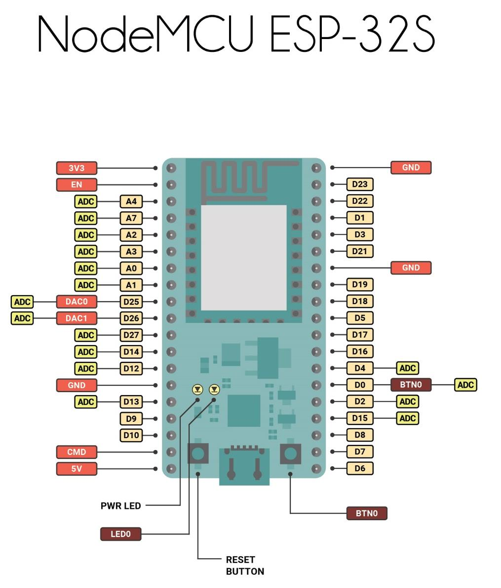
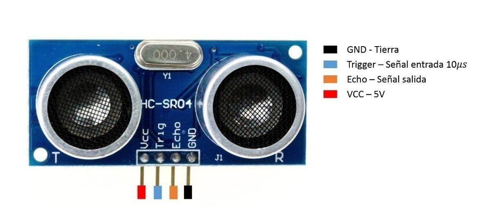
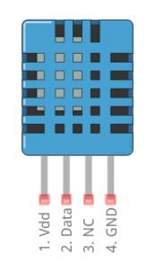
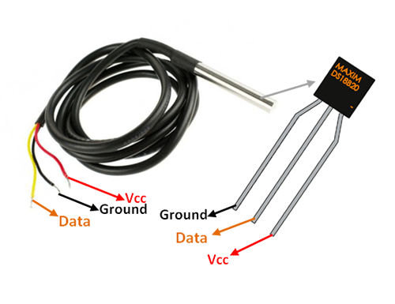

# Tanque de Agua Sensorizado
## By Moyano Franco y Abeijon Diego
-----------------------------------------------------------------------------------------------
## Introducción
El presente informe, junto con las hojas de datos adjuntas, pretende
demostrar el desarrollo del proyecto llevado a cabo en la materia Técnicas Digitales 2,
dictada por los profesores Salamero Martín y Escudero Javier.
El proyecto en general es un trabajo conjunto con otros grupos, encargados
de la domotización de diferentes sectores del hogar. El objetivo que se nos ha asignado
como equipo en particular es lograr medir la cantidad de litros que tiene el tanque de
agua de la casa, la temperatura del agua, la temperatura del ambiente exterior al tanque
y la presencia o no de presión de agua justo antes del ingreso a dicho tanque.
A través del informe se explicarán las tareas ejecutadas para llegar a la
realización del sistema domotizado, tales como la conexión con el servidor elegido por
el profesor y la programación de los sensores.

## La placa de desarrollo

Para la conexión, a través de la internet, al servidor se ha utilizado una placa
Node MCU ESP-32S de Zerynth la cual es programable mediante la interfase de
programación de la placa Arduino con el mismo lenguaje de programación.
La placa utilizada contiene integrado un módulo de WiFi el cual permite
programar directamente el enlace al servidor sin la necesidad de configurar pines para
un módulo externo.
A continuación, se muestra la configuración de los pines de la placa
NodeMCU ESP-32S.

## Sensor HC-SR04

Como se nos ha propuesto detectar la cantidad de litros que tiene el tanque de
agua en tiempo real, hemos decidido usar un sensor de distancia ultrasónico para medir
la distancia entre la tapa del tanque y la superficie del agua. Mediante el cálculo del
volumen de un cilindro, la información de distancia entregada por el sensor se logró
convertir a un volumen en litros.
El sensor ultrasónico se lo ha programado para que, desde el parlante emisor, se
genere una onda sonora durante 10 microsegundos seguida de 2 microsegundos de
silencio. Esta secuencia se la ha programado para ocurrir 5 veces y generar un promedio
de estas lecturas, de modo que, si hay algún movimiento fuera de lo normal en la
superficie del agua, esta perturbación no modifique en gran medida el dato visto por el
usuario.
A continuación se muestra la configuración de los pines del sensor ultrasónico
HC-SR04.

## Sensor DHT11 y presión de agua

Para la medición del ambiente exterior al tanque se ha usado el sensor de
temperatura y humedad DHT11. El mismo ya cuenta con una librería de funciones para
el IDE de Arduino, por lo que su programación no es compleja y no presentó
inconvenientes.
Estos sensores son digitales, lo que implica que la información de temperatura y
humedad se extrae codificada directamente desde el pin DATA.

Como prototipo de sensor de presión de agua se ha utilizado un pulsador normal
abierto, el cual pretende simular la fuerza que ejerce el agua sobre una pieza móvil
generando un pulso en una entrada digital del microcontrolador. Cuando el pulsador
está abierto, el agua no ejerce fuerza, por lo tanto, no hay presión de agua en la entrada
del tanque. Cuando el pulsador está cerrado, el agua ejerce fuerza, y por consiguiente
hay presión de agua en la entrada del tanque.

## Sensor DS18B20

Para medir la temperatura del agua se utilizó un sensor con salida digital
DS18B20 con una cápsula sumergible metálica. Al igual que el sensor DHT11, el DS18B20
posee una librería con funciones especializadas para su lectura directa en grados Celsius,
la cual es codificada a través del cable DATA.
A continuación, se muestra la configuración de los cables del sensor.

## Código

En este apartado se muestra el código completo escrito en la interfase de
programación de Arduino que se ha compilado para programar la placa NodeMCU ESP-
32S.
El programa contiene en el siguiente orden: inclusión de librerías, declaración de
constantes y variables, configuración de los datos usados por la librería
“EspMQTTClient.h”, configuración de los pines de entrada y salida de datos, función que
conecta la placa con el broker MQTT, la función principal iterativa que lee la información
de los sensores y la publica en el servidor, función adyacente del sensor ultrasónico y
función que muestra un mensaje recibido desde el servidor (en caso de ser usada esa
funcionalidad).

Link al codigo

## Conclusiones

Luego de la experiencia con la placa de desarrollo NodeMCU ESP-32S, se
obtuvo experiencia en la conexión entre un cliente y un broker MQTT, y también en la
manipulación de sensores de distancia, y temperatura y humedad.
Como conclusión, este proyecto, y todo lo que conllevó su realización, se
traduce en conocimiento que, sin lugar a duda, será de ayuda para futuras
planificaciones personales y/o productos que entren al mercado.
