# Control luces IoT
## By Mercado Agustín y Delgado Facundo
-------------------------------------------------------------------------------

## Introducción
Este proyecto busca generar habilidades y conocimientos en temas actuales como
“Internet of things - IoT”.
Aprendiendo a utilizar herramientas como Arduino, diversos sensores y servidores
“MQTT”, los cuales, a través de un extenso y trabajado desarrollo, lograremos conectar los
dispositivos a internet y preceder al censado de diferentes magnitudes físicas.
En nuestro caso particular, como grupo, elegimos proceder con la construcción del
proyecto de un módulo eléctrico de hogar, similar al convencional, pero con la particularidad de
conectarse a internet.
Esta llave de luz, la que contaría con un punto y toma, estaría dotada de características
específicas, siendo este capaz de encender la luminaria eléctrica tanto de forma física como
virtual, además tener el control a distancia del enchufe, brindando al usuario diferentes
posibilidades para posibles aplicaciones y usos. Cabe destacar que además el módulo, cuyo
nombre es MODULOX, también es capaz de brindar datos de temperatura en tiempo real, los
cuales pueden ser consultados en cualquier momento.

## MODULOX

Para comenzar a desarrollar el proyecto, primero fue necesario definir bien los objetivos,
especificar características y funcionalidades del dispositivo y planificar el modo de trabajo.

### Objetivos, características y funcionalidades:

  1. El dispositivo debe ser capaz de encender y apagar la luminaria de forma física y virtual,
conmutando entre las dos alternativas, y en caso de fallas en la placa central, el
dispositivo funcione de forma convencional.
  2. El dispositivo debe ser capaz de ofrecer la posibilidad de desconectar eléctricamente el
enchufe del módulo.
  3. El dispositivo debe sentar temperatura de su entorno, y enviar esos datos para ser
consultados o usados para otras aplicaciones.

### Plano descriptivo de conexiones:

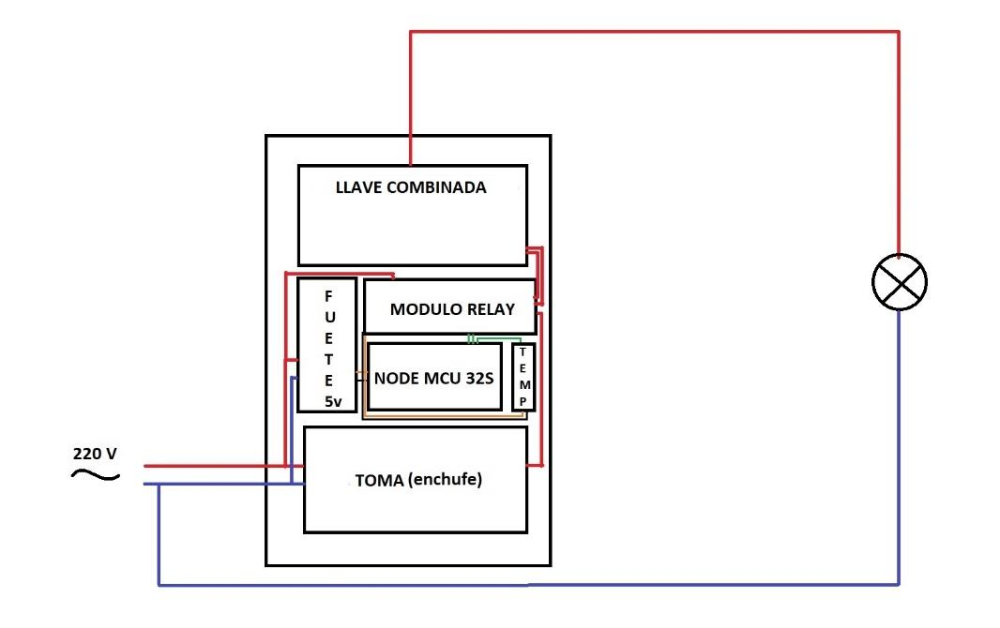

### Planificaciones y modo de trabajo:

* Servidores “MQTT”.
  1. Aprender conceptos básicos sobre servidores MQTT.
  2. Crear una cuenta en el servidor MQTT.
  3. Generar usuarios y tópicos para conectar los dispositivos.
  4. Establecer conexión entre dispositivos.

* Arduino.
  1. Configurar el IDE de desarrollo para programar la placa.
  2. Investigar y seleccionar librerías adecuadas.
  3. Escribir el programa principal.
  4. Cargar el programa principal en la placa.
  
* Hardware.
  1. Probar funcionamiento de la placa NODE MCU-ESP32S.
  2. Comprar materiales y construir los periféricos.
  
## Servidores MQTT:

### ¿Qué es MQTT?
MQ Telemetry Transport es un protocolo de red de publicación-suscripción que
transporta mensajes entre dispositivos. El protocolo generalmente se ejecuta sobre TCP / IP ; sin
embargo, cualquier protocolo de red que proporcione conexiones bidireccionales ordenadas y
sin pérdidas puede admitir MQTT. Está diseñado para conexiones con ubicaciones remotas
donde se requiere una "huella de código pequeña" o el ancho de banda de la red es limitado.
Hay diferentes páginas en internet que ofrecen este servicio, nosotros usaremos
“www.cloudmqtt.com”.

### ¿Cómo funciona el protocolo MQTT?
La siguiente figura describe de forma sencilla el funcionamiento del protocolo. Para su
análisis dividiremos la imagen en tres partes.
Parte número 1, encontramos los diferentes sensores que están publicando información
en el bróker, esos dispositivos pueden ser de diferente naturaleza, sean sensores, dispositivos
móviles, placas inteligentes o computadoras, lo importante es que procesan los datos y los
publican en el servidor.
Parte número 2, llamaremos bróker al sistema intermediario que nos permitirá recibir,
procesar y enviar datos, y dependiendo del servicio que se use tendremos diferentes
posibilidades de aplicación. Al configurar un bróker, generamos usuarios, dentro de estos
usuarios podremos crear diferentes tópicos, los cuales estarán disponibles para recibir (un dispositivo que publica) o enviar (un dispositivo subscripto) datos.Parte número 3, similar a la
parte numero 1, son dispositivos conectados al bróker, pero esta vez recibiendo datos del
mismo, es decir que los dispositivos están subscriptos a un tema en particular previamente
establecido en el bróker.

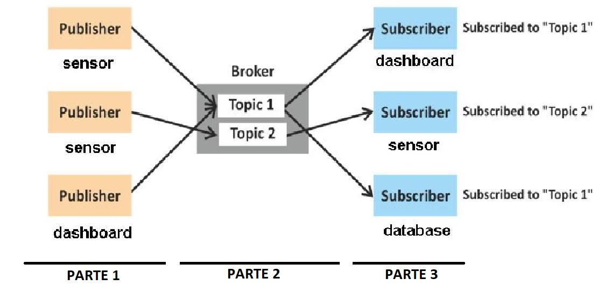

### Creando una cuenta en Cloud MQTT:
1. Nos dirigimos a https://www.cloudmqtt.com/.
2. Nos registramos en la página, creando un usuario y contraseña.
3. Una vez abierto, crearemos una instancia, en nuestro caso “PROJECT-MODULOX”.
4. Al ingresar en la siguiente instancia tenemos información de nuestra instancia:
    * Servidor: soldier.cloudmqtt.com
    * Usuario: ihpzflhj
    * Contraseña: 
    * Puerto: 18629
    * Puerto SSL: 28629
    * Puerto Websockets: 38629
    * Límite de conexiones: 5
  
5. En el menú lateral, ingresamos en la sección de USUARIOS Y ACL.
    * Creamos un usuario y contraseña (MODULOX – 123456).
    * En la parte inferior, seleccionamos el botón “TEMA” y seleccionamos nuestro usuario.
    * Elegimos un nombre de tópico que vamos a usar, en nuestro caso quedo expresado de la siguiente manera.
  
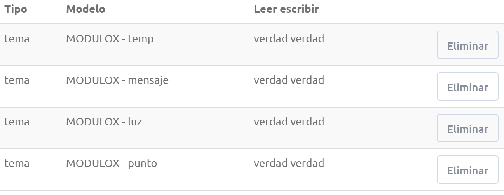

6. Otra sección de nuestro interés en el menú es “WEBSOCKET UI”. En esta sección
encontramos una caja de texto donde podemos enviar mensajes tan solo
ingresando el tema y el mensaje que queremos enviar. Por otro lado, tenemos una
parte donde ver los mensajes recibidos, donde se detalla el tema y el mensaje.

7. Por último, en la pestaña del menú conexiones, podemos ingresar e identificar los
diferentes dispositivos que están conectados al bróker.

## Arduino:
### ¿Qué es?
Es un hardware de código abierto, desarrollado por ARDUINO.CC la cual esta equipada
con conjuntos de pines de entrada y salidas digitales y analógicos a los cuales se puede conectar
diferentes sensores y periféricos. Esta placa se programa en lenguaje C, y ARDUINO.CC provee
de un “ide” de programación propio.
Para este proyecto vamos a usar una placa cuyo nombre NODE MCU ESP 32S, esta placa
también esta equipada con pines de entrada y salida analógicos y digitales, se programa en
lenguaje C, pero cuenta con la particular característica de tener conexiones WIFI y BLUETOOTH
integrados.
Esta placa no es desarrollada por Arduino, pero se puede programar con el “ide” de
Arduino, para ello se debe configurar.

### Configuración de “ide” Arduino:
1. Abrir el “ide” Arduino, si no se tiene instalado descargar de www.arduino.cc .
2. Dirigirse ARCHIVO>PREFERENCIAS>AJUSTES>GESTOR DE URLS ADICIONALES DE
TARJETAS. Y pegamos el siguiente link:
“https://dl.espressif.com/dl/package_esp32_index.json,https://arduino.esp8266.com/stable/package_esp8266com_index.json ”.
3. Le damos ok y nos dirigimos a HERRAMIENTAS>PLACA>GESTOR DE TARJETAS.
Buscamos ESP 32 e instalamos.

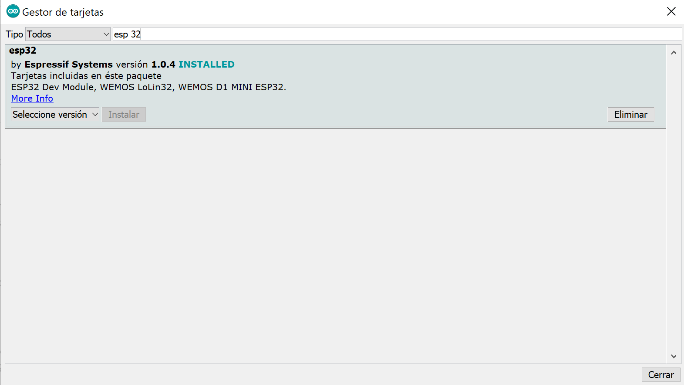

4. Nos dirigimos a HERRAMIENTAS>PLACAS> y buscamos “NODE MCU 32S”, además seleccionamos la velocidad de carga en 115200 baudios.
De esta forma tenemos listo el “ide” de Arduino para programar nuestra placa NODE
MCU 32S con el “ide” Arduino.
En nuestro caso tuvimos problemas con la conexión usb, por lo que procedimos a
actualizar los drivers y a flashear la memoria ROM de la placa. A continuación, se dejan
los links de los tutoriales.
“ https://www.youtube.com/watch?v=9b0Txt-yF7E
http://micropython.org/download#esp32
https://randomnerdtutorials.com/flashing-micropython-firmware-esptool-py-esp32-
esp8266/ “.

### Escribir el programa principal:
Para comenzar a escribir el programa principal, primero investigamos sobre las librerías
disponibles para la placa que íbamos a programar. Decidimos usar la librería
“SimpleMQTTClient.h”, se dejará el link del repositorio donde se detalla el funcionamiento de la
librería y las diferentes funciones que incluye la librería.
“ https://github.com/plapointe6/EspMQTTClient “

#### [Enlace al Codigo](https://github.com/msalamero/Proyectos-Arduino/blob/master/control%20luces%20IoT/MODULOX.ino)

Por último procedimos a cargar el programa en la placa y a probar su funcionamiento,
para ello descargamos una aplicación para Android del Play store llamada “MQTT DASHBOARD”.
donde configuramos un usuario al cual llamamos “TelefonoDePrueba”.
“ https://play.google.com/store/apps/details?id=com.thn.iotmqttdashboard&hl=es_419 ”
Para configurar el Dashboard fue necesario los datos declarados más arriba (servidor,
usuario, contraseña, puerto). A continuación, se muestran algunas capturas de pantalla del
Dashboard correctamente configurado.

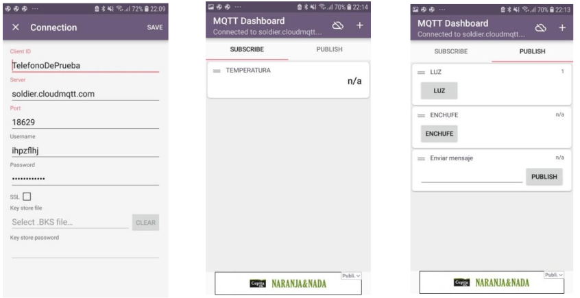

### Pin-Out de placa NodeMCU-32s:
Se adjunta imagen de Pin-Out que se utilizó para mapear los pines de entrada y salida
que se ven en el código.
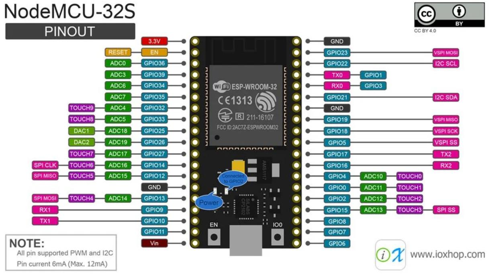

## Entrega del proyecto
Para concluir con la entrega del trabajo, procedimos a hacer la correspondiente configuración de
BROKER, TOPICOS, RED WIFI, DASHBOARD MOVIL, con la finalidad de conectarnos al
servicio mqtt que nos proporciono el profesor a cargo de hacer la revisión.
A continuación se adjuntan algunas imágenes de las diferentes configuraciones, del hardware
detallado y un video donde se puede apreciar el funcionamiento del dispositivo.

[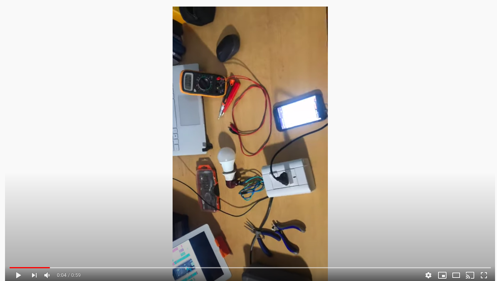](https://www.youtube.com/watch?v=fCmbTSvfbRA&feature=youtu.be)

* TOPICOS:
// temperatura - "room/temp"
// luz - "room/ligth" - on/off
// toma - "room/swich" on/off
//mensaje de estado - "data/state"

* DATOS MQTT:
http://iot.edurobots.com.ar:18083
DASHBOARD PC: http://iot.edurobots.com.ar/login.php
(username, password): a@a , 1234

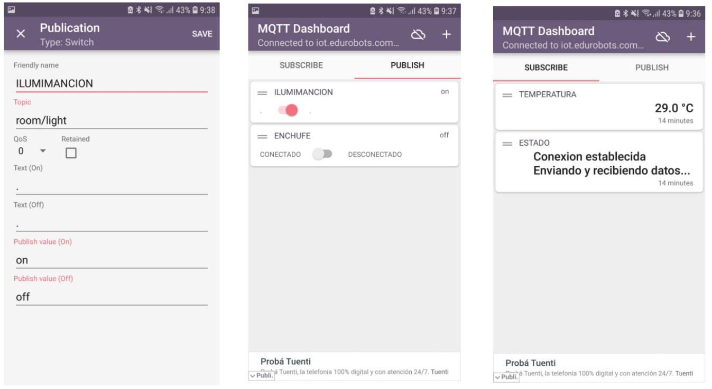
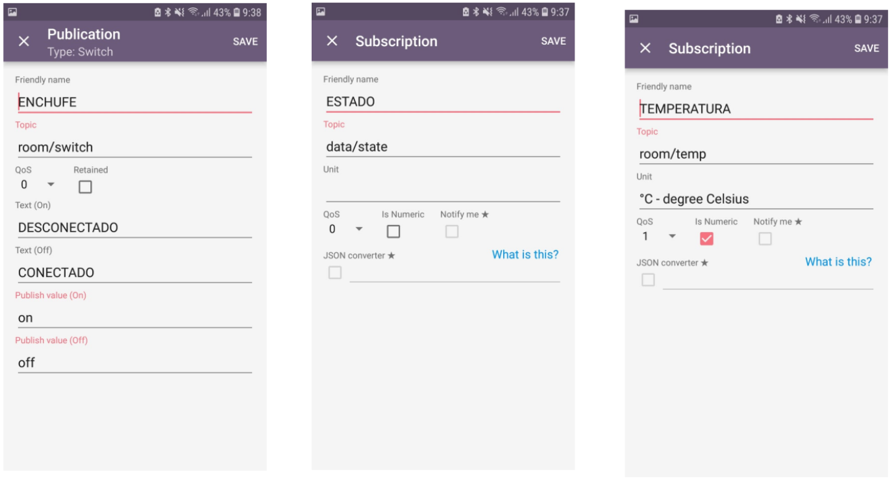
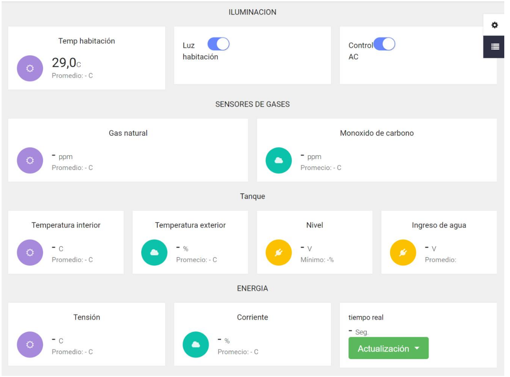
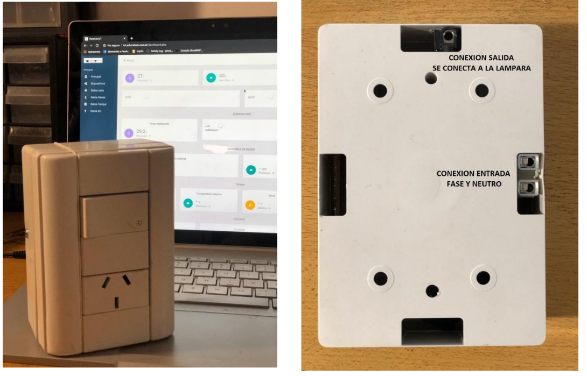
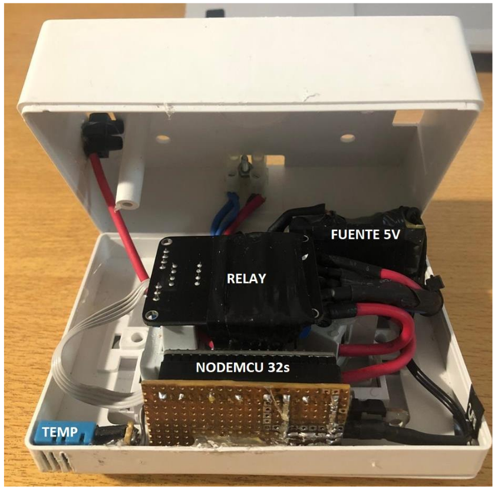

## Conclusión
Al terminar con este proyecto, logramos cumplir con el objetivo de aprender el uso y manejo de
las herramientas necesarias para implementar este tipo de soluciones.
Cabe destacar que el prototipo MODULOX, es una versión en fase BETA, el cual nos gustaría
seguir mejorando, ya que hemos detectado algunas fallas de diseños que con un poco de ingenio
y trabajo podemos ir perfeccionando. A continuación, detallaremos algunas actualizaciones que
podría recibir la versión v1.1 del prototipo.

* Detección de estado de luz encendida o apagada por medio de internet
* Hardware optimizado en una placa más pequeña integrativa e industrializada
* Diseño más moderno y futurista
* Implementación de dispositivos de seguridad correspondientes según las normativas
